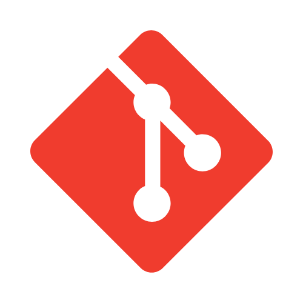

<h1 align="center">
    
</h1>

  <h2>Passionate Software Engineer from Brazil</h2>
  <ol align="left">
    <li>
      <strong>Studies</strong>
      
🌱 Computer Scientist and founder of Cidadanize.

    </li>
    <li>
      <strong>About Me</strong>
      
👻 Rock lover and chess enthusiast.

    </li>
    <li>
      <strong>Interests</strong>
      
⚙️ Passionate about Software Engineering and Design.

    </li>
    <li>
      <strong>Currently Learning</strong>
      
📚 Deep diving into Clean Architecture principles.

    </li>
  </ol>

  
  
  

 
  <h2>⚒️ Languages, Frameworks, and Tools ⚒️</h2>

  <strong>Backend</strong> 
  
  
  
  

  

  <strong>Frontend</strong> 
  
  
  
  
  
  

  

  <strong>Other</strong> 
  
  
  
  

